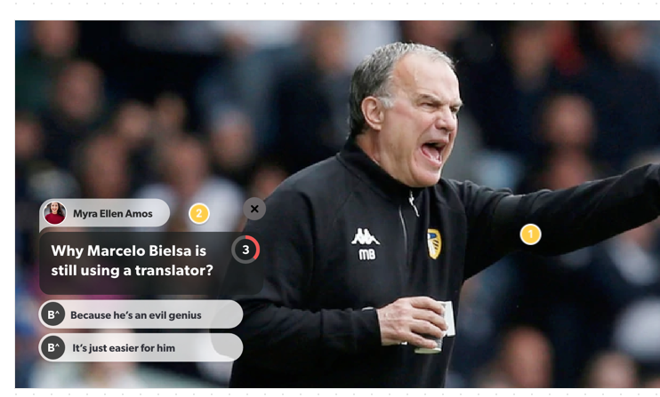

# Buff UP LTD JS/TypeScript Dev. Test

# The Task:

Create a JS/TypeScript library using our Rest API to show content of top of an HTML 5 Video Player

## Requirements:

We now want a JS/Typescript file that allows to display content (Buff's as we call them) over any existing video player.

The library should have the following features

- Automatically detect the player frame and put a transparent layer on top of that view that will display our content
- Handle all the business and UI logic to display the Buffs over the video in the view
- Using the API endpoints provided, fetch 5 Buffs and display them on top of the video stream displaying only one at a time (Transition in between Buffs is open).
- The Buff should be displayed with a countdown timer matching the time in the `time_to_show` field for each Buff.
- If the user votes before the end of the timer (taps on an answer), you should freeze the timer show the right/wrong answer and hide the Buff after 2 seconds.
- If the timer expires and the user doesn't vote, you should hide the Buff.
- If the user manually closes the Buff by tapping on the top right `x` close button, you should hide the Buff.

### UI

The UI should look like this:



- [ ] The countdown timer should work and at the end if the user hasn't yet voted, the question should automatically hide

- [ ] The number of answers can vary from 2 to 5, your UI should automatically adapt to the number of answers that the API delivers

- [ ] When the user selects an answer, the correct answer should be highlighted letting the user if they got it right (UI of your choice)

## What we are looking for:

- A demo page with the video player and the Javascript/Typescript file.
- Demonstration of coding style and design patterns.
- Error handling.
- Any form of unit testing you see fit.
- Use the design provided as a guidance, we are not expecting a pixel perfect solution.

## How to Submit your solution:

- Clone this repository
- Create a repo in github, bitbucket or a suitable alternative and provide a link to the repository.
- Provide a readme in markdown which details of your code and any libraries that you may have used (feel free to use any libraries you see fit)
- Explain how we should test the solution

## API Usage

This is a brief summary of the api endpoints you will need in order to create the library. Reaching the endpoint shown below you should be able to get a json response with all the information needed for this task. Feel free to add any extra information in the UI you see relevant.

#### Base URL

The base URL is `http://demo2373134.mockable.io/`

#### Get Buff

Gets the data to show the Buff

```
GET /buff/:buffId

Buff Id is the id of the buff to fetch
In the sample Rest API Buffs with Id's 1 to 5 are available
```

Sample response:

```
{
    "data": {
        "id": 1895,
        "stream_id": 18,
        "client_id": 6,
        "user_id": 16,
        "name": "placeholder",
        "question": "Who would you rather have as your Warzone partner?",
        "participation_points": 9,
        "type": 3,
        "status": 3,
        "statusText": "expired",
        "language": "en",
        "public": false,
        "priority": 1,
        "replay": true,
        "delay": 0,
        "duration": 15,
        "play_at": null,
        "resolve_at": null,
        "resolved_at": null,
        "published_at": "2020-09-28T19:21:06Z",
        "expire_at": 2892939,
        "expires_at": "2020-09-28T19:21:32Z",
        "author": {
            "id": 12,
            "first_name": "DreamHack",
            "last_name": "Games",
            "photo": [
                "https://buffup-api-staging.s3.eu-west-1.amazonaws.com/clients/6/authors/%25%21d%28string%3D30581b1a-9c78-4c96-97e0-5700c1fe039e%29/photo/1x.png",
                "https://buffup-api-staging.s3.eu-west-1.amazonaws.com/clients/6/authors/%25%21d%28string%3D30581b1a-9c78-4c96-97e0-5700c1fe039e%29/photo/2x.png",
                "https://buffup-api-staging.s3.eu-west-1.amazonaws.com/clients/6/authors/%25%21d%28string%3D30581b1a-9c78-4c96-97e0-5700c1fe039e%29/photo/3x.png",
                "https://buffup-api-staging.s3.eu-west-1.amazonaws.com/clients/6/authors/%25%21d%28string%3D30581b1a-9c78-4c96-97e0-5700c1fe039e%29/photo/original.png"
            ]
        },
        "answers": [
            {
                "id": 5325,
                "buff_id": 1895,
                "title": "Nick",
                "image": [
                    "https://buffup-api-staging.s3.eu-west-1.amazonaws.com/clients/6/answers/7fe95db1-ab92-46cd-912e-1e3938b9293f/1x.png",
                    "https://buffup-api-staging.s3.eu-west-1.amazonaws.com/clients/6/answers/7fe95db1-ab92-46cd-912e-1e3938b9293f/2x.png",
                    "https://buffup-api-staging.s3.eu-west-1.amazonaws.com/clients/6/answers/7fe95db1-ab92-46cd-912e-1e3938b9293f/3x.png",
                    "https://buffup-api-staging.s3.eu-west-1.amazonaws.com/clients/6/answers/7fe95db1-ab92-46cd-912e-1e3938b9293f/original.png"
                ],
                "bg_color": "#000000",
                "fg_color": "#ffffff"
            },
            {
                "id": 5324,
                "buff_id": 1895,
                "title": "Vikk",
                "image": [
                    "https://buffup-api-staging.s3.eu-west-1.amazonaws.com/clients/6/answers/3ad8bc35-bbf2-458d-bce3-dc85f535713e/1x.png",
                    "https://buffup-api-staging.s3.eu-west-1.amazonaws.com/clients/6/answers/3ad8bc35-bbf2-458d-bce3-dc85f535713e/2x.png",
                    "https://buffup-api-staging.s3.eu-west-1.amazonaws.com/clients/6/answers/3ad8bc35-bbf2-458d-bce3-dc85f535713e/3x.png",
                    "https://buffup-api-staging.s3.eu-west-1.amazonaws.com/clients/6/answers/3ad8bc35-bbf2-458d-bce3-dc85f535713e/original.png"
                ],
                "bg_color": "#000000",
                "fg_color": "#ffffff"
            }
        ]
    }
}
```

Good luck!
